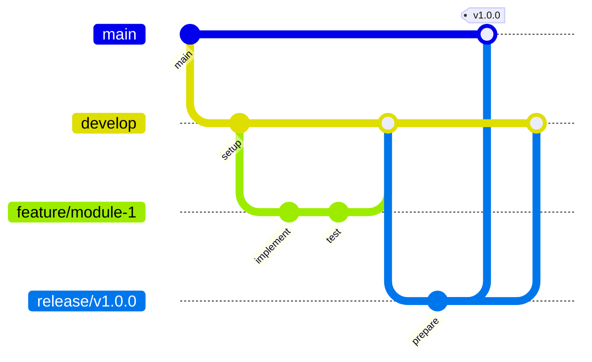

# Contributing to Learning Event-Driven Microservices

Thank you for your interest in contributing to this learning repository! This guide will help you understand our development workflow and coding standards.

## 🔄 Git Flow Workflow

We follow the **Git Flow** branching strategy. Please familiarize yourself with the complete workflow in [docs/git-flow-strategy.md](docs/git-flow-strategy.md).

### Quick Reference



## 🚀 Getting Started

### 1. Fork and Clone

```shell
# Fork the repository on GitHub, then clone your fork
git clone https://github.com/YOUR_USERNAME/learning-event-driven.git
cd learning-event-driven

# Add upstream remote
git remote add upstream https://github.com/ORIGINAL_OWNER/learning-event-driven.git
```

### 2. Set Up Development Environment

```shell
# Ensure you have Go 1.21+ installed
go version

# Install dependencies
go mod tidy

# Create and switch to develop branch
git checkout -b develop origin/develop
```

## 📝 Development Workflow

### Starting a New Feature

```shell
# Always start from the latest develop branch
git checkout develop
git pull upstream develop

# Create a feature branch
git checkout -b feature/module-X-description
```

### Branch Naming Conventions

- **Features**: `feature/module-X-description` (e.g., `feature/module-1-foundations`)
- **Bug fixes**: `fix/issue-description` (e.g., `fix/user-service-validation`)
- **Documentation**: `docs/topic` (e.g., `docs/api-documentation`)
- **Chores**: `chore/task-description` (e.g., `chore/update-dependencies`)

### Commit Message Format

We use **Conventional Commits** specification:

```shell
<type>(<scope>): <description>

[optional body]

[optional footer(s)]
```

#### Types

- `feat`: New feature
- `fix`: Bug fix
- `docs`: Documentation changes
- `style`: Code style changes (formatting, etc.)
- `refactor`: Code refactoring
- `test`: Adding or updating tests
- `chore`: Maintenance tasks

#### Examples

```shell
feat(module-1): implement basic HTTP server
fix(user-service): handle nil pointer in validation
docs(readme): add setup instructions
test(order-service): add integration tests
chore(deps): update Go dependencies
```

### Code Standards

#### Go Code Style

- Follow [Effective Go](https://golang.org/doc/effective_go.html) guidelines
- Use `gofmt` for formatting
- Use `golint` for linting
- Write meaningful variable and function names
- Add comments for exported functions and types

#### Project Structure

```shell
modules/
├── module-XX-name/
│   ├── README.md           # Module-specific documentation
│   ├── cmd/                # Main applications
│   ├── internal/           # Private application code
│   │   ├── domain/         # Domain entities and business logic
│   │   ├── usecase/        # Application use cases
│   │   ├── interface/      # Interface adapters (HTTP, gRPC)
│   │   └── infrastructure/ # External concerns (DB, messaging)
│   ├── pkg/                # Public library code
│   ├── test/               # Test files and test data
│   ├── deployments/        # Kubernetes manifests
│   └── docs/               # Module documentation
```

#### Documentation Standards

- Every module must have a comprehensive README.md
- Use Mermaid diagrams for architecture visualization
- Document APIs with examples
- Include setup and testing instructions

### Testing Requirements

```shell
# Run tests before committing
go test ./...

# Run tests with coverage
go test -cover ./...

# Run integration tests (if applicable)
go test -tags=integration ./...
```

### Pre-commit Checklist

- [ ] Code follows Go conventions and is properly formatted
- [ ] All tests pass
- [ ] Documentation is updated (if applicable)
- [ ] Commit messages follow conventional format
- [ ] No sensitive information in code
- [ ] Module README is updated (for new modules)

## 🔍 Pull Request Process

### 1. Create Pull Request

```shell
# Push your feature branch
git push origin feature/your-feature-name

# Create PR on GitHub targeting 'develop' branch
```

### 2. PR Template

When creating a PR, please include:

```markdown
## Description
Brief description of changes and motivation.

## Type of Change
- [ ] Bug fix
- [ ] New feature
- [ ] Documentation update
- [ ] Refactoring

## Module
- [ ] Module 1: Foundations
- [ ] Module 2: Clean Architecture
- [ ] Module 3: DDD
- [ ] Module 4: Event-Driven Architecture
- [ ] Module 5: Microservices Implementation
- [ ] Other: ___________

## Testing
- [ ] Unit tests added/updated
- [ ] Integration tests added/updated
- [ ] Manual testing completed

## Documentation
- [ ] README updated
- [ ] API documentation updated
- [ ] Mermaid diagrams added/updated

## Checklist
- [ ] Code follows project conventions
- [ ] Self-review completed
- [ ] Tests pass locally
- [ ] No merge conflicts
```

### 3. Review Process

- All PRs require at least one review
- Address review feedback promptly
- Keep PRs focused and reasonably sized
- Rebase if requested to maintain clean history

## 🏗 Module Development Guidelines

### Creating a New Module

1. **Create module directory structure**
2. **Add comprehensive README.md**
3. **Implement following Clean Architecture**
4. **Add tests with good coverage**
5. **Document with Mermaid diagrams**
6. **Update main README.md**

### Module README Template

Each module should include:

- Learning objectives
- Prerequisites
- Setup instructions
- Architecture overview (with Mermaid)
- API documentation
- Testing instructions
- Next steps

## 🐛 Reporting Issues

### Bug Reports

- Use GitHub Issues
- Include Go version, OS, and reproduction steps
- Provide minimal code example if possible

### Feature Requests

- Describe the learning objective
- Explain how it fits into the curriculum
- Provide implementation suggestions

## 📚 Learning Resources

- [Git Flow Cheatsheet](https://danielkummer.github.io/git-flow-cheatsheet/)
- [Conventional Commits](https://www.conventionalcommits.org/)
- [Effective Go](https://golang.org/doc/effective_go.html)
- [Clean Architecture](https://blog.cleancoder.com/uncle-bob/2012/08/13/the-clean-architecture.html)

## 🤝 Code of Conduct

- Be respectful and inclusive
- Focus on learning and teaching
- Provide constructive feedback
- Help others learn and grow

## 📞 Getting Help

- Create an issue for bugs or questions
- Use discussions for general questions
- Check existing documentation first

---

Thank you for contributing to this learning journey! 🚀
