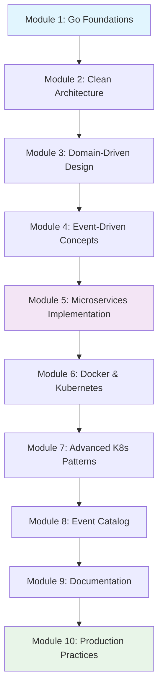
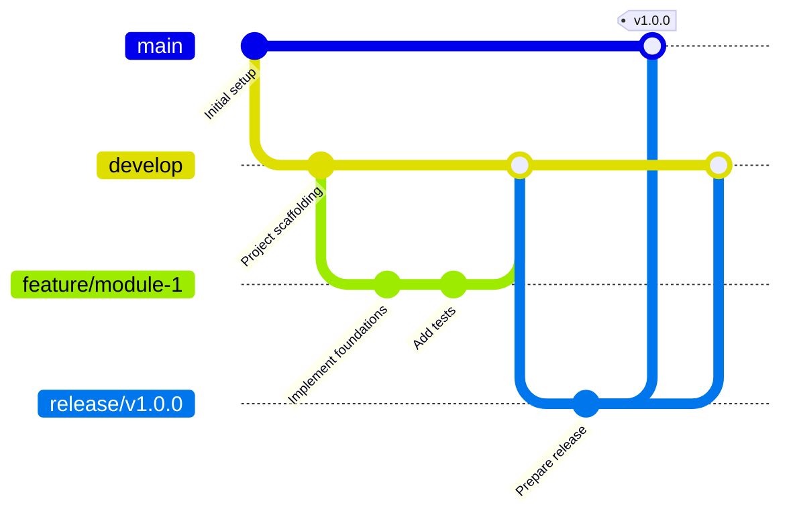

# Learning Event-Driven Microservices - Setup Instructions

This document provides comprehensive setup instructions following [Augment Code Guidelines](https://docs.augmentcode.com/setup-augment/guidelines#workspace-guidelines) for initializing and working with this learning repository.

## 🎯 Repository Overview

This repository is designed as a hands-on learning experience for mastering event-driven microservices architecture using Go. It follows a structured 10-module curriculum with practical implementations.

### Learning Architecture



## 🚀 Quick Start

### Prerequisites

Ensure you have the following installed:

- **Go 1.21+** - [Download](https://golang.org/doc/install)
- **Git** - [Download](https://git-scm.com/downloads)
- **Docker** - [Download](https://docs.docker.com/get-docker/)
- **kubectl** - [Download](https://kubernetes.io/docs/tasks/tools/)
- **VS Code** (recommended) - [Download](https://code.visualstudio.com/)

### Initial Setup

1. **Clone and Initialize**

   ```shell
   git clone <repository-url>
   cd learning-event-driven
   
   # Run setup script (choose based on your OS)
   # For Linux/macOS:
   chmod +x scripts/setup.sh && ./scripts/setup.sh
   
   # For Windows PowerShell:
   .\scripts\setup.ps1
   ```

2. **Create Development Branch**

   ```shell
   git checkout -b develop
   git push -u origin develop
   ```

3. **Verify Setup**

   ```shell
   go version          # Should show 1.21+
   go mod tidy         # Download dependencies
   go test ./...       # Run tests (should pass)
   ```

## 📁 Workspace Structure

Following Augment Code guidelines, the repository is organized for maximum clarity and modularity:

```shell
learning-event-driven/
├── 📚 docs/                     # Learning materials and documentation
│   ├── learning-path.md         # 10-module curriculum details
│   └── git-flow-strategy.md     # Git workflow guidelines
├── 🏗️ modules/                  # Module-specific implementations
│   ├── module-01/               # Go foundations
│   ├── module-02/               # Clean architecture
│   └── ...                     # Additional modules
├── 🔧 shared/                   # Shared utilities and types
│   ├── config/                 # Configuration management
│   ├── types/                  # Common data types
│   └── utils/                  # Utility functions
├── 🚀 deployments/             # Kubernetes manifests and Helm charts
├── 📜 scripts/                 # Build and deployment scripts
├── ⚙️ .github/                 # GitHub Actions workflows
├── 📖 README.md                # Main project documentation
├── 🤝 CONTRIBUTING.md          # Contribution guidelines
├── 📄 LICENSE                  # MIT License
└── 📦 go.mod                   # Go module definition
```

## 🔄 Development Workflow

### Git Flow Strategy

We follow **Git Flow** for structured development:



### Branch Types

- **`main`**: Production-ready code with semantic versioning
- **`develop`**: Integration branch for ongoing development  
- **`feature/module-X`**: Individual module implementations
- **`release/vX.Y.Z`**: Version preparation and stabilization
- **`hotfix/description`**: Critical production fixes

### Starting a New Module

```shell
# 1. Start from develop
git checkout develop
git pull origin develop

# 2. Create feature branch
git checkout -b feature/module-1-foundations

# 3. Create module structure
mkdir -p modules/module-01/{cmd,internal/{domain,usecase,interface,infrastructure},pkg,test,docs}

# 4. Implement module following Clean Architecture
# 5. Add comprehensive tests
# 6. Document with README and Mermaid diagrams
# 7. Commit with conventional format
git commit -m "feat(module-1): implement Go foundations with HTTP server"

# 8. Create Pull Request targeting develop
```

## 📝 Code Standards

### Go Code Guidelines

- Follow [Effective Go](https://golang.org/doc/effective_go.html) principles
- Use `gofmt` for consistent formatting
- Implement Clean Architecture layers:
  - **Domain**: Business entities and rules
  - **Use Case**: Application business logic
  - **Interface**: Adapters (HTTP, gRPC, CLI)
  - **Infrastructure**: External concerns (DB, messaging)

### Module Structure Template

```shell
modules/module-XX-name/
├── README.md                    # Module documentation
├── cmd/                        # Main applications
│   └── main.go
├── internal/                   # Private application code
│   ├── domain/                # Entities, value objects, aggregates
│   ├── usecase/               # Application use cases
│   ├── interface/             # Interface adapters
│   └── infrastructure/        # External concerns
├── pkg/                       # Public library code
├── test/                      # Test files and test data
├── docs/                      # Module-specific documentation
└── deployments/               # Module deployment configs
```

### Documentation Standards

- **README.md** for each module with:
  - Learning objectives
  - Prerequisites and setup
  - Architecture overview (Mermaid diagrams)
  - API documentation with examples
  - Testing instructions
- **Mermaid diagrams** for architecture visualization
- **API documentation** with request/response examples
- **Event schemas** in Event Catalog format

## 🧪 Testing Strategy

### Test Types

```shell
# Unit tests
go test ./...

# Integration tests
go test -tags=integration ./...

# Coverage report
go test -cover ./...

# Benchmark tests
go test -bench=. ./...
```

### Test Structure

- Unit tests alongside source code
- Integration tests in `test/` directories
- Test data in `testdata/` directories
- Mocks and stubs for external dependencies

## 🔧 Development Tools

### Recommended VS Code Extensions

- **Go** - Official Go extension
- **GitLens** - Git supercharged
- **Mermaid Preview** - Diagram visualization
- **YAML** - YAML language support
- **Docker** - Docker integration

### Pre-commit Hooks

The setup script installs Git hooks that:

- Format code with `gofmt`
- Run tests before commits
- Lint code (if golangci-lint available)

## 📊 Module Learning Path

### Phase 1: Foundations (Weeks 1-4)

1. **Module 1**: Go fundamentals and HTTP services
2. **Module 2**: Clean Architecture implementation
3. **Module 3**: Domain-Driven Design principles
4. **Module 4**: Event-driven architecture concepts

### Phase 2: Implementation (Weeks 5-8)

5. **Module 5**: Event-driven microservices with messaging
6. **Module 6**: Containerization with Docker & Kubernetes
7. **Module 7**: Advanced Kubernetes patterns
8. **Module 8**: Event Catalog for visualization

### Phase 3: Production (Weeks 9-10)

9. **Module 9**: Documentation with Markdown & Mermaid
10. **Module 10**: Production practices and capstone project

## 🚨 Troubleshooting

### Common Issues

#### **Go Module Issues**

```shell
# Clean module cache
go clean -modcache
go mod download
```

#### **Git Flow Issues**

```shell
# Reset to develop
git checkout develop
git reset --hard origin/develop
```

#### **Docker Issues**

```shell
# Clean Docker resources
docker system prune -a
```

## 📚 Additional Resources

- [Learning Path Details](docs/learning-path.md)
- [Git Flow Strategy](docs/git-flow-strategy.md)
- [Contributing Guidelines](CONTRIBUTING.md)
- [Augment Code Guidelines](https://docs.augmentcode.com/setup-augment/guidelines#workspace-guidelines)

## 🎓 Learning Support

- **Issues**: Use GitHub Issues for bugs and questions
- **Discussions**: Use GitHub Discussions for general questions
- **Documentation**: Check module READMEs first
- **Code Reviews**: All PRs require review for learning feedback

---

**Ready to start your event-driven microservices journey? Begin with Module 1! 🚀**
