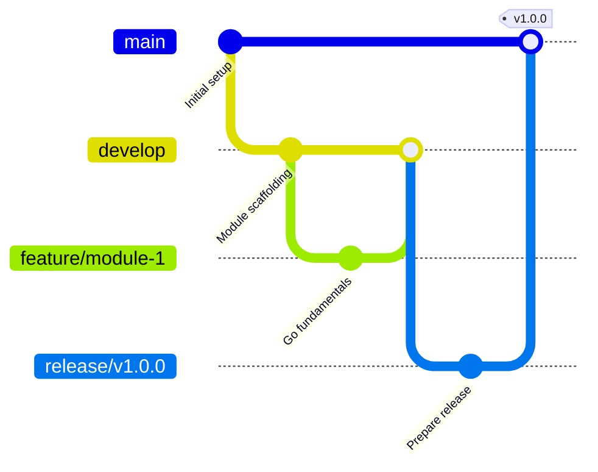

# Learning Event-Driven Microservices in Go

[](https://golang.org)
[](https://opensource.org/licenses/MIT)

A comprehensive learning repository for mastering event-driven microservices architecture using Go, following Clean Architecture principles, Domain-Driven Design (DDD), and modern DevOps practices.

## 🎯 Learning Objectives

This repository follows a structured 10-module learning path designed to take you from Go fundamentals to production-grade event-driven microservices:

- **Go Fundamentals** → Advanced patterns and Clean Architecture
- **Domain-Driven Design** → Event-driven architecture concepts  
- **Microservices Development** → Containerization with Docker & Kubernetes
- **Event Catalog** → Documentation with Markdown & Mermaid
- **Production Practices** → CI/CD, monitoring, and observability

## 📚 Learning Path

### Phase 1: Foundations (Weeks 1-4)

- **Module 1**: Go Fundamentals & Basic HTTP Services
- **Module 2**: Clean Architecture Implementation  
- **Module 3**: Domain-Driven Design Essentials
- **Module 4**: Event-Driven Architecture Concepts

### Phase 2: Implementation (Weeks 5-8)

- **Module 5**: Building Event-Driven Go Microservices
- **Module 6**: Docker & Kubernetes Basics
- **Module 7**: Advanced Kubernetes Patterns
- **Module 8**: Event Catalog for Visualization

### Phase 3: Production (Weeks 9-10)

- **Module 9**: Documentation with Markdown & Mermaid
- **Module 10**: Capstone Project & Production Practices

📖 **Detailed Learning Path**: [docs/learning-path.md](docs/learning-path.md)

## 🔄 Git Workflow

This project follows **Git Flow** branching strategy:



- **`main`**: Production-ready code with semantic versioning
- **`develop`**: Integration branch for ongoing development
- **`feature/*`**: Individual module implementations
- **`release/*`**: Version preparation and stabilization
- **`hotfix/*`**: Critical production fixes

📋 **Git Strategy Details**: [docs/git-flow-strategy.md](docs/git-flow-strategy.md)

## 🚀 Quick Start

### Prerequisites

- **Go 1.21+** - [Install Go](https://golang.org/doc/install)
- **Docker** - [Install Docker](https://docs.docker.com/get-docker/)
- **kubectl** - [Install kubectl](https://kubernetes.io/docs/tasks/tools/)
- **Git** - [Install Git](https://git-scm.com/downloads)

### Setup

1. **Clone the repository**

   ```shell
   git clone <repository-url>
   cd learning-event-driven
   ```

2. **Initialize Go module** (if not already done)

   ```shell
   go mod tidy
   ```

3. **Create develop branch**

   ```shell
   git checkout -b develop
   git push -u origin develop
   ```

4. **Start with Module 1**

   ```shell
   git checkout -b feature/module-1-foundations
   # Begin Module 1 exercises
   ```

## 📁 Project Structure

```shell
learning-event-driven/
├── docs/                    # Documentation and learning materials
│   ├── learning-path.md     # Detailed 10-module curriculum
│   └── git-flow-strategy.md # Git workflow guidelines
├── modules/                 # Module-specific implementations
│   ├── module-01-foundations/
│   ├── module-02-clean-arch/
│   ├── module-03-ddd/
│   └── ...
├── pkg/                    # Shared utilities and common code
├── deployments/            # Kubernetes manifests and Helm charts
├── scripts/                # Build and deployment scripts
├── .github/                # GitHub Actions workflows
├── README.md               # This file
├── CONTRIBUTING.md         # Contribution guidelines
├── LICENSE                 # MIT License
└── go.mod                  # Go module definition
```

## 🛠 Technologies & Tools

### Core Technologies

- **Language**: Go 1.21+
- **Architecture**: Clean Architecture + DDD
- **Messaging**: Apache Kafka / NATS JetStream
- **Database**: PostgreSQL
- **Containerization**: Docker
- **Orchestration**: Kubernetes

### Development Tools

- **Documentation**: Markdown + Mermaid diagrams
- **Event Visualization**: Event Catalog
- **CI/CD**: GitHub Actions
- **Monitoring**: Prometheus + Grafana
- **Tracing**: Jaeger

## 📖 Documentation Standards

Following [Augment Code Guidelines](https://docs.augmentcode.com/setup-augment/guidelines#workspace-guidelines):

- **Clear module separation** with dedicated directories
- **Comprehensive README** files for each module
- **Mermaid diagrams** for architecture visualization
- **API documentation** with examples
- **Event schemas** documented in Event Catalog format

## 🤝 Contributing

Please read [CONTRIBUTING.md](CONTRIBUTING.md) for details on our Git Flow process and coding standards.

### Quick Contribution Guide

1. **Create feature branch** from `develop`

   ```shell
   git checkout develop
   git checkout -b feature/your-feature-name
   ```

2. **Follow conventional commits**

   ```shell
   git commit -m "feat(module-1): implement user service"
   ```

3. **Create Pull Request** targeting `develop`

## 📝 License

This project is licensed under the MIT License - see the [LICENSE](LICENSE) file for details.

## 🎓 Learning Resources

- [The Go Programming Language](https://golang.org/doc/) - Official Go documentation
- [Clean Architecture](https://blog.cleancoder.com/uncle-bob/2012/08/13/the-clean-architecture.html) - Robert C. Martin
- [Domain-Driven Design](https://domainlanguage.com/ddd/) - Eric Evans
- [Event Catalog Documentation](https://www.eventcatalog.dev/docs/) - Event visualization
- [Kubernetes Documentation](https://kubernetes.io/docs/) - Container orchestration

---

### **Happy Learning! 🚀**

*This repository is designed as a hands-on learning experience. Each module builds upon the previous one, creating a comprehensive understanding of modern microservices architecture.*
