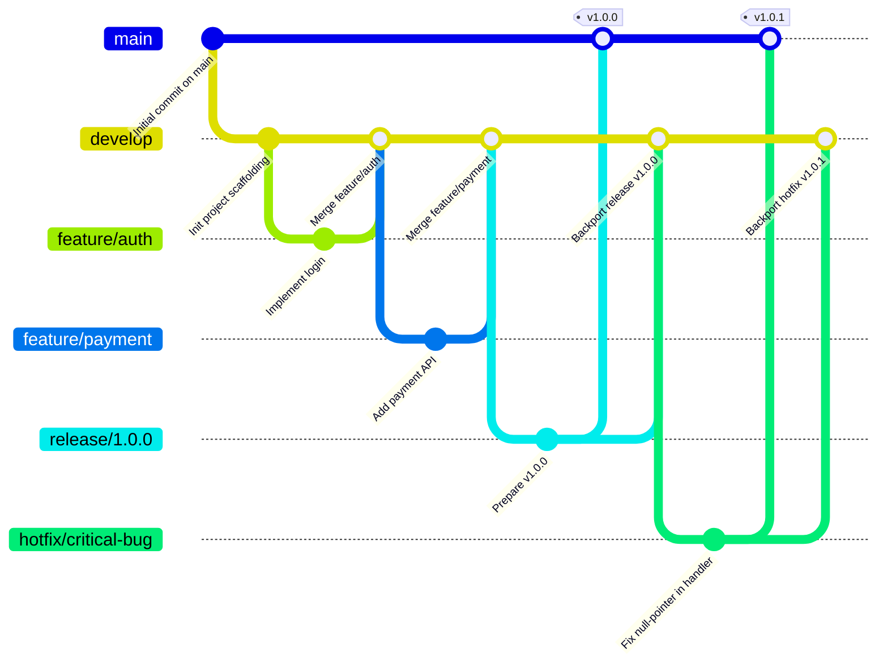

# Git Flow Strategy for Event-Driven Microservices

Here’s a suggested Git branching and release workflow—based on the popular “Git Flow” model—that will take you from initial setup all the way through production releases and hot-fixes. You can adapt branch names, naming conventions, and CI triggers to fit your team’s preferences.

---

## Branch Types & Naming

* **`main`**

  * Always reflects production-ready code.
  * Every commit here is tagged with a semantic version (e.g. `v1.2.3`).

* **`develop`**

  * Integration branch for features and fixes.
  * Automatically deployed to your staging environment via CI.

* **Feature branches**

  * Named: `feature/<short-description>`
  * Branch off `develop`, merge back into `develop` when done.

* **Release branches**

  * Named: `release/<version>` (e.g. `release/1.0.0`)
  * Branch off `develop` when you’re stabilizing for a new version.
  * Bug-fix and docs updates go here.
  * When ready, merge into both `main` **and** back into `develop`.

* **Hotfix branches**

  * Named: `hotfix/<short-desc>` (e.g. `hotfix/login-crash`)
  * Branch off `main` to fix production issues.
  * Once validated, merge back into `main` (and tag), **and** into `develop`.

---

## Workflow Overview



---

## Typical Day-to-Day Commands

1. **Start a feature**

   ```shell
   git checkout develop
   git pull origin develop
   git checkout -b feature/<name>
   ```

2. **Finish a feature**

   ```shell
   git add .
   git commit -m "feat(auth): add JWT login endpoint"
   git push -u origin feature/auth
   ```

   → Open a PR targeting `develop`, run CI/tests, get reviews, then merge.

3. **Create a release**

   ```shell
   git checkout develop
   git pull origin develop
   git checkout -b release/1.2.0
   # update version in go.mod, CHANGELOG.md, etc.
   git commit -am "chore(release): prepare v1.2.0"
   git push -u origin release/1.2.0
   ```

   → PR → merge into `main` & tag, then merge back into `develop`.

4. **Hotfix production**

   ```shell
   git checkout main
   git pull origin main
   git checkout -b hotfix/login-crash
   # fix
   git commit -am "fix(auth): handle missing user gracefully"
   git push -u origin hotfix/login-crash
   ```

   → PR → merge into `main` & tag, then merge into `develop`.

---

## Branch Protection & CI

* **Protect** both `main` and `develop`:

  * Require passing CI (tests, lint, security scans).
  * Require ≥1 code review.
  * Disable direct pushes; use pull requests only.

* **CI Triggers**:

  * **`develop`** → deploy to staging environment.
  * **`release/*`** and **`hotfix/*`** → run full regression suite.
  * **`main` tags** → trigger production deployment pipeline.

---

## Commit & PR Conventions

* Adopt **Conventional Commits**:

  ```shell
  <type>(<scope>): <short description>
  ```

  * Types: `feat`, `fix`, `chore`, `docs`, `refactor`, `test`, etc.
  * Example: `feat(order): validate stock before confirmation`

* **Pull Request Templates**:

  * **Description**: What problem does this solve?
  * **Changes**: Summary of changes.
  * **Testing**: How was it tested?
  * **Checklist**: Linked issues, tests added, docs updated.

---

## Versioning & Tagging

* Use **Semantic Versioning**: `MAJOR.MINOR.PATCH`

  * **MAJOR**: incompatible API changes.
  * **MINOR**: backwards-compatible features.
  * **PATCH**: bug fixes.

* After merging a release or hotfix into `main`, tag:

  ```shell
  git tag -a v1.2.0 -m "Release v1.2.0"
  git push origin v1.2.0
  ```

---

### Tips for a Smooth Start

1. **Initialize** your repo with `README.md`, `.gitignore`, `LICENSE` on `main`.
2. Create a `develop` branch right away:

   ```shell
   git checkout -b develop
   git push -u origin develop
   ```

3. Configure your CI to build both `develop` and tags from `main`.
4. Document this workflow in your repo’s **CONTRIBUTING.md** (with a Mermaid diagram!).
5. Automate semantic-release or changelog generation if desired (e.g. GitHub Actions).
